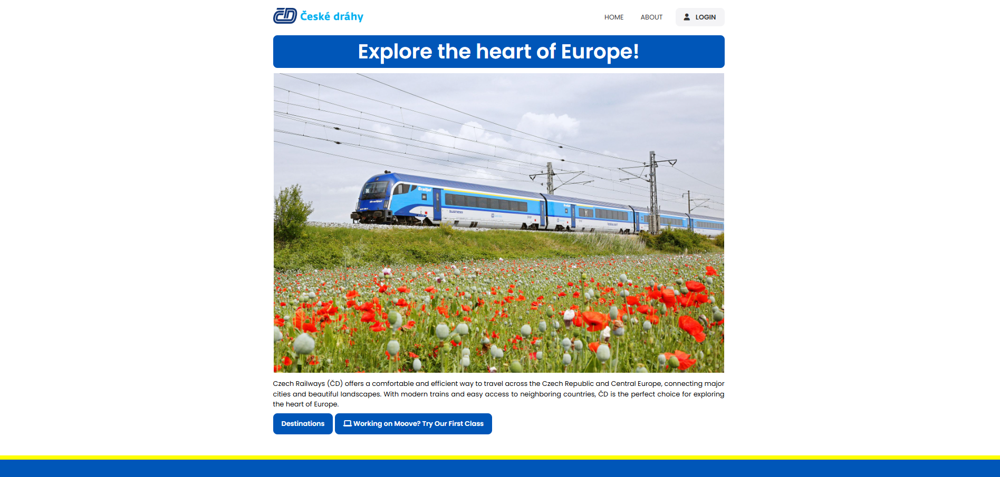

# Webside with information about travelling in the Czech republic

This project I have chosen, because I wanted to show how travelling back home looks like.

Basic of this project is from https://www.youtube.com/watch?v=HXYZxVbWkjc&t=1160s, other necessary tools during development were https://geojson.io/  https://www.w3schools.com/howto/howto_js_slideshow.asp and https://stackoverflow.com/questions/19104018/how-to-expand-an-image-in-html-by-clicking-on-it 

It is built with: HTML - index.html | CSS  - style.css | JavaScript - JAVASCRIPT.js | Images/ - all necessary images for webside  

